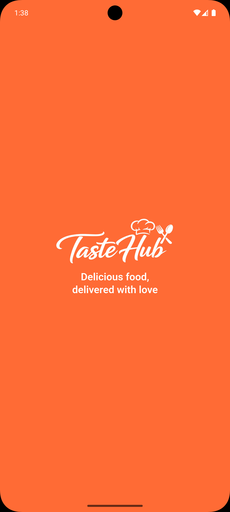
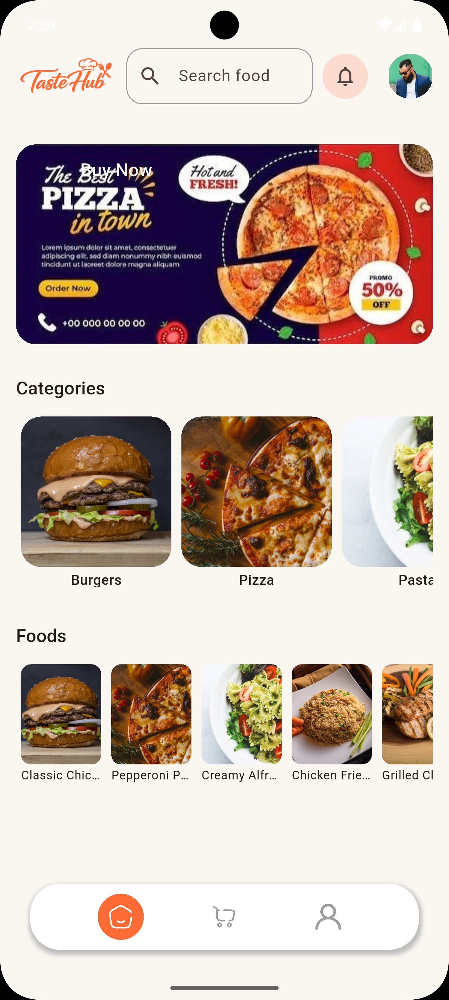
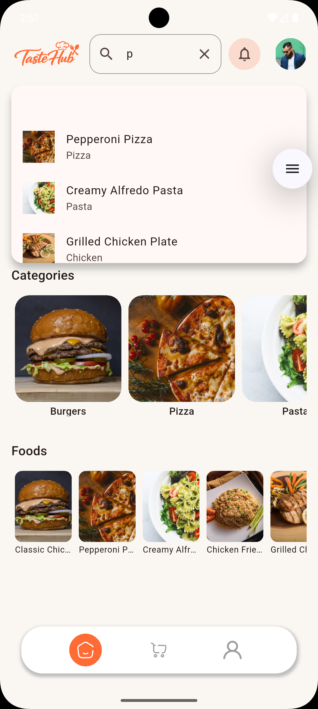
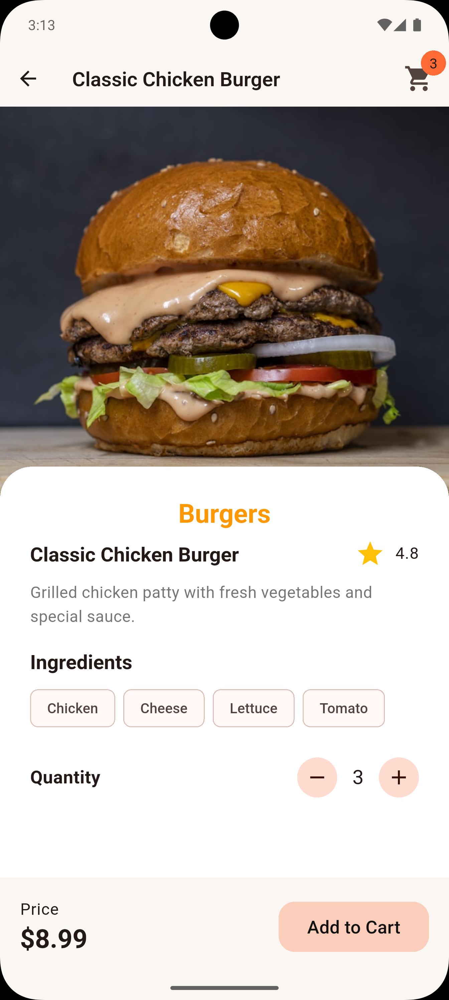
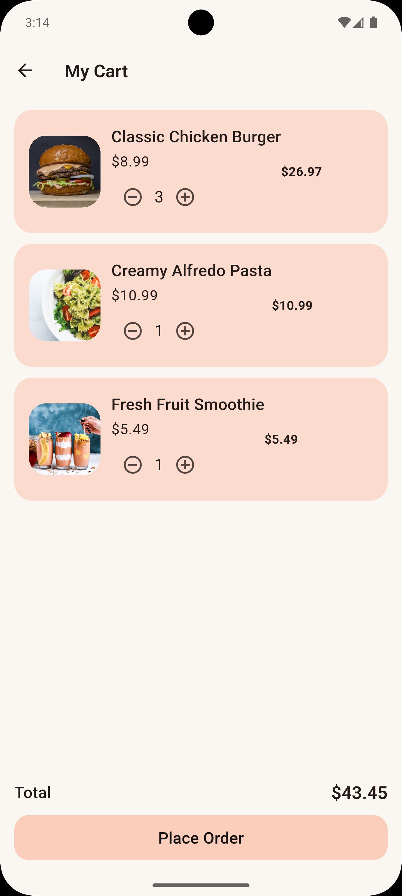
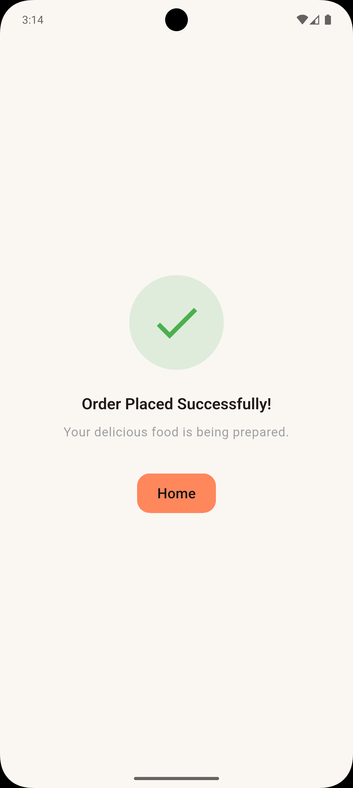

# TasteHub

A modern restaurant ordering mobile application built with Flutter.  
This project was developed as part of the **Mobile App Developer Intern Assessment**.

TasteHub allows users to browse food items, view detailed information, manage their cart, and simulate placing an order.

---

## Screens

The application includes the following screens:

- Splash Screen
- Login Screen (UI only)
- Home Screen
- Food Details Screen
- Cart Screen
- Order Success Screen

---

## Features

### Food Browsing
- Display restaurant food items
- View food categories and food cards
- Search food items by name
- View detailed food information

### Cart Management
- Add food items to cart
- Increase/decrease item quantity
- Remove items from cart
- Automatically calculate total price

### Order Processing
- Review cart items
- Place order (simulation only)
- Display order success confirmation

---

## Tech Stack

### Mobile Application
- Flutter
- Dart

### State Management
- Riverpod

### Navigation
- GoRouter

### Local Data
- Local JSON / Mock Data

### UI Components
- Material Design
- Custom reusable widgets

---

## Getting Started

### Prerequisites

Make sure you have installed:

- Flutter SDK
- Android Studio / VS Code
- Android Emulator or Physical Device

Check Flutter installation:

```bash
flutter doctor
```
---

# 📥 Installation

Clone the repository:

```bash
git clone <repository-url>
```

Navigate to project directory:

```bash
cd tastehub
```

Install dependencies:

```bash
flutter pub get
```

Run the application:

```bash
flutter run
```

---

# Build APK

To generate a release APK:

```bash
flutter build apk --release
```

Generated APK location:

```
build/app/outputs/flutter-apk/app-release.apk
```

---

# Screenshots

<table>
  <tr>
    <td></td>
    <td></td>
    <td></td>
  </tr>
  <tr>
    <td></td>
    <td></td>
    <td></td>
  </tr>
  <tr>
    <td></td>
  </tr>
</table>

---

# UI/UX Highlights

- Modern restaurant-focused interface
- Clean card-based food presentation
- Responsive layouts
- Smooth navigation experience
- Reusable custom widgets
- Consistent color theme and typography

---

# Architecture

The application follows a feature-based architecture.

## Benefits:
- Better code organization
- Easy maintenance
- Scalable project structure
- Separation of concerns

The project separates:

- UI components
- Business logic
- Models
- Navigation
- Shared utilities

---

# State Management

Riverpod is used for state management.

It handles:

- Cart state
- Food item updates
- Application state changes

Benefits:

- Predictable state updates
- Better scalability
- Clean separation between UI and logic

---

# Navigation

GoRouter is used for application navigation.

Handled routes:

- Splash
- Login
- Home
- Food Details
- Cart
- Order Success

---

# Limitations

- Login functionality is UI only
- Food items are loaded from local mock data
- No real backend integration
- No payment gateway integration
- Order placement is simulated

---

# Developer

**Pathum Dilhara**
Flutter Mobile Application Developer
---
